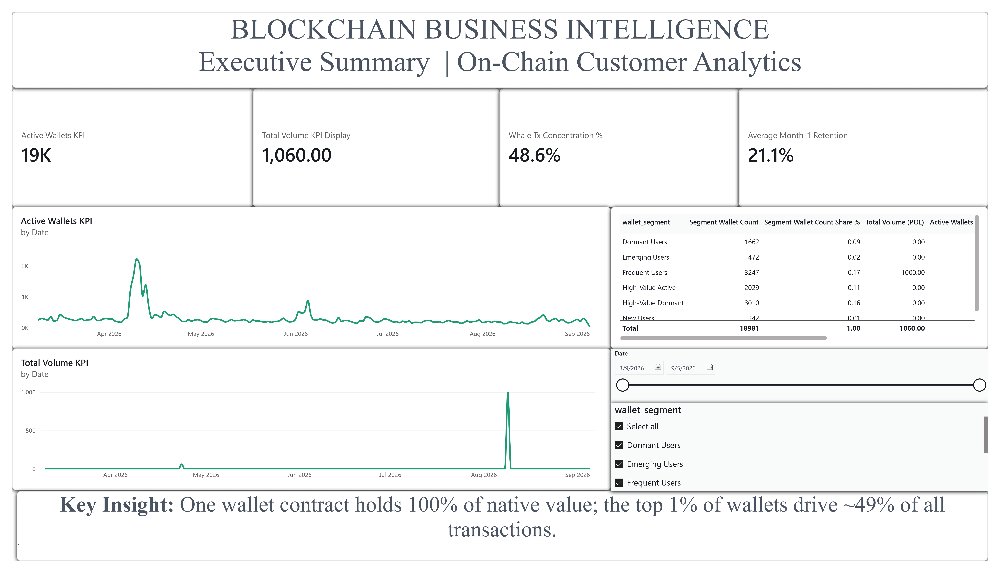
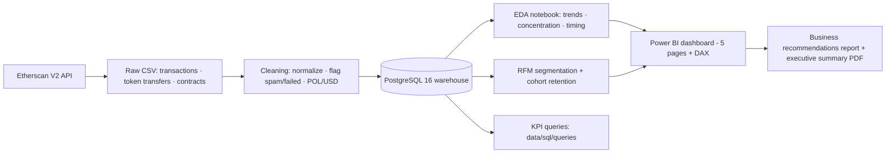

# Blockchain Business Intelligence

**Turning on-chain transaction data into customer segmentation, retention analysis, and business recommendations for a DeFi protocol.**


## Project Overview

This project treats the **Aave V3 Pool** on **Polygon PoS** like a real business —
with stakeholders, requirements, and KPIs — instead of a trading signal. It
pulls every on-chain interaction with the protocol from the public blockchain,
builds a relational data warehouse, performs exploratory, customer-level, and
retention analysis, and delivers a Power BI dashboard plus an executive
recommendations report. The point is the *business analysis habit*: on-chain
data is just a (very granular) customer activity log.

| | |
|---|---|
| **Protocol / chain** | Aave V3 Pool `0x794a…4814ad` · Polygon PoS (chainid 137) |
| **Window** | 2026-03-09 → 2026-09-05 (181 days) |
| **Scale** | 18,981 wallets · 158,916 transactions · 159 contracts · 163 token transfers |
| **Source** | Etherscan V2 unified API (Polygonscan, public on-chain data) |
| **Stack** | Python, PostgreSQL, SQL (window functions / CTEs), Power BI + DAX, pandas, seaborn |

## Key Findings

Three results worth stopping on (full analysis with evidence in [`outputs/reports/business_recommendations.md`](outputs/reports/business_recommendations.md)):

1. **Not growth — a spike and a decay.** Active wallets peaked at **12,407 in April**, then fell **−94%** to 716 (partial) by September. The April cohort alone is **58% of all wallets** and retained only **4.7%** after one month.
2. **Thin, concentrated, and therefore risky.** The **top 1% of wallets (~190) drive ~49% of all transactions**; the busiest single wallet executed **8,054** of them. A handful of (likely automated) accounts is a material dependency.
3. **Poor retention, expensive to ignore.** Average month-1 retention is **21.1%**; the RFM split is 43.8% Occasional, 17.1% Frequent, 15.9% High-Value Dormant, 10.7% High-Value Active, 8.8% Dormant, 2.5% Emerging, 1.3% New. The cheapest growth is winning back the base that already exists.

> 🚨 **Data-model caveat worth knowing:** Aave supplies move as ERC-20 aTokens, so **native POL value is degenerate** at the Pool level (~100% sits in the Pool contract, median tx value = 0). Engagement numbers above are direct ledger counts; the *monetary* KPIs are explicitly flagged as a measurement gap (fixed by recommendation R-3) rather than silently reported as $0.

## Dashboard Preview

Power BI dashboard, 5 pages (Executive Summary · Customer Intelligence · Retention Analysis · Operations & Cost · Recommendations). Page 1:



Other pages: [2 · Customer Intelligence](outputs/figures/dashboard/blockchain_bi_dashboard_page-0002.png) · [3 · Retention Analysis](outputs/figures/dashboard/blockchain_bi_dashboard_page-0003.png) · [4 · Operations & Cost](outputs/figures/dashboard/blockchain_bi_dashboard_page-0004.png) · [5 · Recommendations](outputs/figures/dashboard/blockchain_bi_dashboard_page-0005.png)

## Tech Stack

| Layer | Tool |
|---|---|
| Extraction | Python `requests` · Etherscan V2 API (block-chunked, resumable, rate-limit-safe) |
| Storage | PostgreSQL 16 (`blockchain_bi`) — `wallets`, `transactions`, `contracts`, `token_transfers` |
| Analysis | pandas · SQL window functions / CTEs · RFM (NTILE) · cohort retention · seaborn · scipy |
| Reporting | Jupyter (`notebooks/01_eda.ipynb`) · Power BI Desktop + DAX · Markdown + pandoc/typst PDF |
| Orchestration | Python scripts in `src/` (see run order below) |

## Architecture / Pipeline



## Repo Structure

```
blockchain-business-intelligence/
├── README.md                 ← you are here
├── requirements.txt          # pinned analysis stack
├── .env.example              # EXPLORER_API_KEY + DATABASE_URL (never commit .env)
├── docs/                     # business requirements, KPI framework, stakeholder map,
│                             #   data dictionary, methodology, limitations, findings
├── data/
│   ├── raw/                  # API extracts (gitignored, reproduced by scripts)
│   ├── processed/            # cleaned CSVs (gitignored, reproduced by scripts)
│   └── sql/                  # schema.sql + KPI queries (q1..q5)
├── src/
│   ├── extraction/           # Etherscan V2 pull scripts
│   ├── transformation/       # cleaning + load to PostgreSQL
│   └── analysis/             # EDA notebook builder, RFM, cohorts, dashboard export, PDF
├── notebooks/                # notebooks/01_eda.ipynb (executed, with outputs)
├── dashboard/                # DAX measures, build spec, data extracts, .pbix (local)
└── outputs/
    ├── figures/              # 11 EDA charts + 5 dashboard page screenshots
    └── reports/              # business_recommendations.md + executive_summary.pdf
```

## How to Run This Project

Prereqs: Python 3.11+, PostgreSQL 16 running, an Etherscan V2 API key.

```powershell
# 1. Set up
git clone https://github.com/rutujkale/blockchain-business-intelligence.git
cd blockchain-business-intelligence
python -m venv venv
.\venv\Scripts\pip install -r requirements.txt
Copy-Item .env.example .env          # add EXPLORER_API_KEY + DATABASE_URL

# 2. Schema — create the warehouse tables
psql -h 127.0.0.1 -U postgres -d blockchain_bi -f data/sql/schema.sql

# 3. Extraction (pulls ~6 months of on-chain data)
.\venv\Scripts\python.exe src\extraction\fetch_transactions.py
.\venv\Scripts\python.exe src\extraction\fetch_contract_metadata.py

# 4. Cleaning + load
.\venv\Scripts\python.exe src\transformation\clean_transactions.py
.\venv\Scripts\python.exe src\transformation\load_to_postgres.py

# 5. Analysis (EDA → RFM → cohorts → dashboard extracts)
.\venv\Scripts\python.exe src\analysis\build_eda_notebook.py
.\venv\Scripts\jupyter-nbconvert.exe --to notebook --execute --inplace notebooks\01_eda.ipynb
.\venv\Scripts\python.exe src\analysis\rfm_segmentation.py
.\venv\Scripts\python.exe src\analysis\cohort_retention.py
.\venv\Scripts\python.exe src\analysis\export_for_dashboard.py

# 6. Dashboard
#    Open dashboard/blockchain_bi_dashboard.pbix in Power BI Desktop
#    (imports the 5 CSVs in dashboard/data_extracts/ — see dashboard/build_spec.md)
```

**Notes**
- `load_to_postgres.py --reset` rebuilds tables from scratch.
- Analysis scripts connect with `jit=off` (documented in `docs/methodology.md`) for local servers missing the LLVM runtime.
- Raw/processed CSV data is gitignored for size; every artifact is reproducible by the scripts above in the order shown.

## Methodology & Limitations

- **[`docs/methodology.md`](docs/methodology.md)** — data source, extraction method, cleaning rules, RFM scoring logic, cohort definitions, statistical methods, and the exact run order / artifact map.
- **[`docs/limitations.md`](docs/limitations.md)** — every assumption and known gap, stated honestly (native-value degeneracy, wallet-vs-human, bot activity, partial September, and more).

## Skills Demonstrated

- **Data Analysis** — SQL window functions & CTEs (RFM scoring, whale concentration, cohort retention), exploratory analysis with seaborn, statistical correlation (`scipy`), Python ETL pipeline.
- **Blockchain Domain Knowledge** — wallet/transaction semantics, gas-cost analysis, whale/agent detection, ERC-20 token-transfer handling (spam filtering, decimals), reading native/value vs. aToken positions.
- **Business Analysis** — business-requirements definition (BR-01…BR-07), stakeholder mapping, KPI framework design (KPI-01…KPI-07), executive reporting with evidence-backed recommendations.

## License

[MIT](LICENSE).

All data in this project is **public on-chain data** from Polygon; no personal
information is processed or stored. The API key used for extraction lives only
in local `.env` and is never committed.