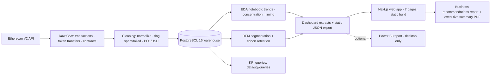

# Blockchain Business Intelligence

**Turning on-chain transaction data into customer segmentation, retention analysis, and business recommendations for a DeFi protocol.**


## Project Overview

This project treats the **Aave V3 Pool** on **Polygon PoS** like a real business —
with stakeholders, requirements, and KPIs — instead of a trading signal. It
pulls every on-chain interaction with the protocol from the public blockchain,
builds a relational data warehouse, performs exploratory, customer-level, and
retention analysis, and ships a **web application** with seven analytical pages
plus an executive recommendations report. The point is the *business analysis
habit*: on-chain data is just a (very granular) customer activity log.

| | |
|---|---|
| **Protocol / chain** | Aave V3 Pool `0x794a…4814ad` · Polygon PoS (chainid 137) |
| **Window** | 2026-03-09 → 2026-09-05 (181 days) |
| **Scale** | 18,981 wallets · 158,916 transactions · 159 contracts · 163 token transfers |
| **Source** | Etherscan V2 unified API (Polygonscan, public on-chain data) |
| **Deliverable** | Next.js web app (7 pages) · secondary Power BI report |
| **Stack** | Python, PostgreSQL, SQL (window functions / CTEs), Next.js 16, React 19, Tailwind v4, Recharts, pandas, seaborn |

## Key Findings

Three results worth stopping on (full analysis with evidence in [`outputs/reports/business_recommendations.md`](outputs/reports/business_recommendations.md)):

1. **Not growth — a spike and a decay.** Active wallets peaked at **12,407 in April**, then fell **−94%** to 716 (partial) by September. The April cohort alone is **58% of all wallets** and retained only **4.7%** after one month.
2. **Thin, concentrated, and therefore risky.** The **top 1% of wallets (~190) drive ~49% of all transactions**; the busiest single wallet executed **8,054** of them. A handful of (likely automated) accounts is a material dependency.
3. **Poor retention, expensive to ignore.** Average month-1 retention is **21.1%**; the RFM split is 43.8% Occasional, 17.1% Frequent, 15.9% High-Value Dormant, 10.7% High-Value Active, 8.8% Dormant, 2.5% Emerging, 1.3% New. The cheapest growth is winning back the base that already exists.

> 🚨 **Data-model caveat worth knowing:** Aave supplies move as ERC-20 aTokens, so **native POL value is degenerate** at the Pool level (~100% sits in the Pool contract, median tx value = 0). Engagement numbers above are direct ledger counts; the *monetary* KPIs are explicitly flagged as a measurement gap (fixed by recommendation R-3) rather than silently reported as $0.

## Web Application

The primary deliverable is a Next.js 16 app in [`webapp/`](webapp) covering the
same analysis as the original report in seven pages:

| Page | What it answers |
|---|---|
| **Overview** | Peak, decay, concentration, gas and scope in five KPIs plus activity and interaction charts. |
| **Customer Intelligence** | RFM segment distribution, per-segment frequency, and the top-wallet table. |
| **Retention Analysis** | Month-over-month cohort matrix, average decay curve, and the month-1 cliff by cohort. |
| **Operations** | Daily throughput, failure rate, hour-of-day/day-of-week heatmap, top wallets, flash loans and liquidations. |
| **Analytics** | Function mix (supply / withdraw / borrow / repay), flash-loan and liquidation rates. |
| **Insights** | All 11 findings and 8 recommendations, verbatim from the report, with evidence paths and confidence. |
| **System** | Pipeline provenance, the two "active wallet" labeling rules, and all 11 disclosed limitations. |

The design system (tokens, type scale, spacing, elevation) is ported from a
Stitch-generated "Precision Analytical System" spec into Tailwind v4 `@theme`.
Every monetary figure carries a caveat that links to the System page, because
native-POL value is degenerate at the Pool level.

Data is exported to 13 static JSON payloads and read from disk during
`next build` — no database and no runtime fetching, so the app deploys as a
static site. Regenerate with:

```powershell
.\venv\Scripts\python.exe src\analysis\export_for_webapp.py
```

The Power BI report is retained as a secondary desktop artifact — see
[`dashboard/README.md`](dashboard/README.md). Its `.pbix` is not committed and
is rebuilt locally from `dashboard/data_extracts/`.

## Tech Stack

| Layer | Tool |
|---|---|
| Extraction | Python `requests` · Etherscan V2 API (block-chunked, resumable, rate-limit-safe) |
| Storage | PostgreSQL 16 (`blockchain_bi`) — `wallets`, `transactions`, `contracts`, `token_transfers` |
| Analysis | pandas · SQL window functions / CTEs · RFM (NTILE) · cohort retention · seaborn · scipy |
| **Web app** | **Next.js 16 (App Router) · React 19 · TypeScript · Tailwind v4 · Recharts** |
| Reporting | Jupyter (`notebooks/01_eda.ipynb`) · Markdown + pandoc/typst PDF |
| Secondary | Power BI Desktop + DAX (optional, not committed) |
| Orchestration | Python scripts in `src/` (see run order below) |

## Architecture / Pipeline


```mermaid
flowchart LR
    A[Etherscan V2 API] --> B[Raw CSV: transactions · token transfers · contracts]
    B --> C[Cleaning: normalize · flag spam/failed · POL/USD]
    C --> D[(PostgreSQL 16 warehouse)]
    D --> E[EDA notebook: trends · concentration · timing]
    D --> F[RFM segmentation + cohort retention]
    E --> G[Dashboard extracts + static JSON export]
    F --> G
    G --> H[Next.js web app - 7 pages, static build]
    G -.optional.-> I[Power BI report - desktop only]
    D --> J[KPI queries: data/sql/queries]
    H --> K[Business recommendations report + executive summary PDF]
```

## Repo Structure

```
blockchain-business-intelligence/
├── README.md                 ← you are here
├── requirements.txt          # pinned analysis stack
├── .env.example              # EXPLORER_API_KEY + DATABASE_URL (never commit .env)
├── docs/                     # business requirements, KPI framework, stakeholder map,
│                             #   data dictionary, methodology, limitations, findings
├── data/
│   ├── raw/                  # API extracts (gitignored, reproduced by scripts)
│   ├── processed/            # cleaned CSVs (gitignored, reproduced by scripts)
│   └── sql/                  # schema.sql + KPI queries (q1..q5)
├── src/
│   ├── extraction/           # Etherscan V2 pull scripts
│   ├── transformation/       # cleaning + load to PostgreSQL
│   └── analysis/             # EDA notebook builder, RFM, cohorts, dashboard export, PDF
├── notebooks/                # notebooks/01_eda.ipynb (executed, with outputs)
├── webapp/                   # Next.js 16 app — the primary deliverable
│   ├── app/                  # layout + page (server) and globals.css (Stitch @theme)
│   ├── components/           # shell (Sidebar/TopBar/Drawer) + the 7 page views
│   ├── lib/                  # dataset loader, types, formatters, CSV export
│   └── public/data/          # 13 static JSON payloads read at build time
├── dashboard/                # optional Power BI: DAX, build spec, data extracts
└── outputs/
    ├── figures/              # 12 EDA charts (cited as evidence in the findings)
    └── reports/              # business_recommendations.md + executive_summary.pdf
```

## How to Run This Project

Prereqs: Python 3.11+, PostgreSQL 16 running, an Etherscan V2 API key.

```powershell
# 1. Set up
git clone https://github.com/rutujkale/blockchain-business-intelligence.git
cd blockchain-business-intelligence
python -m venv venv
.\venv\Scripts\pip install -r requirements.txt
Copy-Item .env.example .env          # add EXPLORER_API_KEY + DATABASE_URL

# 2. Schema — create the warehouse tables
psql -h 127.0.0.1 -U postgres -d blockchain_bi -f data/sql/schema.sql

# 3. Extraction (pulls ~6 months of on-chain data)
.\venv\Scripts\python.exe src\extraction\fetch_transactions.py
.\venv\Scripts\python.exe src\extraction\fetch_contract_metadata.py

# 4. Cleaning + load
.\venv\Scripts\python.exe src\transformation\clean_transactions.py
.\venv\Scripts\python.exe src\transformation\load_to_postgres.py

# 5. Analysis (EDA → RFM → cohorts → dashboard extracts)
.\venv\Scripts\python.exe src\analysis\build_eda_notebook.py
.\venv\Scripts\jupyter-nbconvert.exe --to notebook --execute --inplace notebooks\01_eda.ipynb
.\venv\Scripts\python.exe src\analysis\rfm_segmentation.py
.\venv\Scripts\python.exe src\analysis\cohort_retention.py
.\venv\Scripts\python.exe src\analysis\export_for_dashboard.py

# 6. Web app (primary deliverable) — no database needed, reads static JSON
cd webapp
npm install
npm run dev            # http://localhost:3000

# 7. Optional: Power BI report (desktop only, .pbix not committed)
#    See dashboard/README.md — import the 5 CSVs in dashboard/data_extracts/
```

### Regenerating the web app data

The web app reads 13 JSON payloads from `webapp/public/data/`, written from the
CSV extracts and pipeline logs. No database is required to build or run it:

```powershell
.\venv\Scripts\python.exe src\analysis\export_for_webapp.py
```

**Notes**
- `load_to_postgres.py --reset` rebuilds tables from scratch.
- Analysis scripts connect with `jit=off` (documented in `docs/methodology.md`) for local servers missing the LLVM runtime.
- Raw/processed CSV data is gitignored for size; every artifact is reproducible by the scripts above in the order shown.
- On Windows PowerShell, use `npm.cmd` / `npx.cmd` instead of `npm` / `npx` if script execution is blocked by policy.

## Methodology & Limitations

- **[`docs/methodology.md`](docs/methodology.md)** — data source, extraction method, cleaning rules, RFM scoring logic, cohort definitions, statistical methods, and the exact run order / artifact map.
- **[`docs/limitations.md`](docs/limitations.md)** — every assumption and known gap, stated honestly (native-value degeneracy, wallet-vs-human, bot activity, partial September, and more).

## Skills Demonstrated

- **Data Analysis** — SQL window functions & CTEs (RFM scoring, whale concentration, cohort retention), exploratory analysis with seaborn, statistical correlation (`scipy`), Python ETL pipeline.
- **Blockchain Domain Knowledge** — wallet/transaction semantics, gas-cost analysis, whale/agent detection, ERC-20 token-transfer handling (spam filtering, decimals), reading native/value vs. aToken positions.
- **Business Analysis** — business-requirements definition (BR-01…BR-07), stakeholder mapping, KPI framework design (KPI-01…KPI-07), executive reporting with evidence-backed recommendations.
- **Product Engineering** — a 7-page Next.js 16 / React 19 dashboard on build-time static JSON, a ported 45-token design system into Tailwind v4 `@theme`, responsive layouts (desktop / tablet / mobile with table-to-card collapse), client-side CSV export, and honest data disclosure (dual "active wallet" definitions, a caveat on every monetary figure, all 11 limitations published in-app).

## License

[MIT](LICENSE).

All data in this project is **public on-chain data** from Polygon; no personal
information is processed or stored. The API key used for extraction lives only
in local `.env` and is never committed.